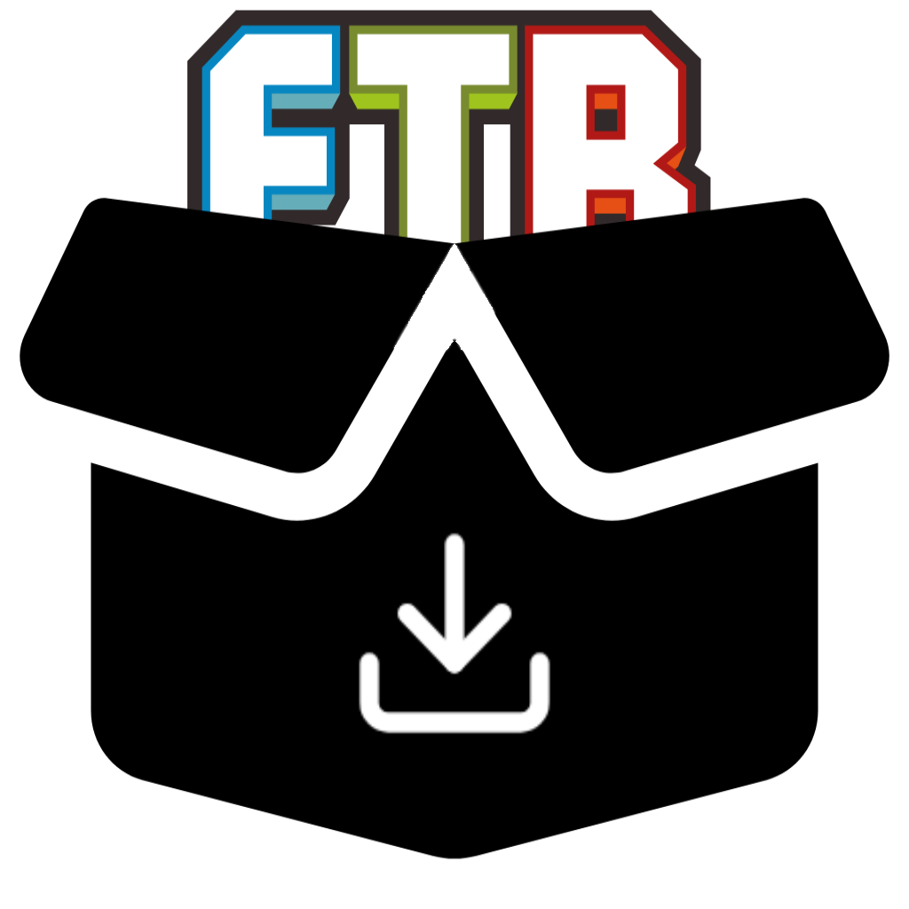

<div align="center"> 
    
   <h1>Feed The Forge</h1>
</div>

## Introduce
This is a simple tool to download modpacks from FTB without the need of the FTB Launcher.

You can then import or drag this zip file into any curseforge compatible launcher. 

For example: HMCL, PCL2, Prism Launcher etc.

## Usage
WIP

## Develop and Build
### Requirements
- **[Git](https://git-scm.com/downloads)**
- **[Python](https://www.python.org/downloads/)**: 3.8+
- **Supported Operating Systems**: Windows 10 or later, macOS, Linux

### Running from Source

1. **Install Dependencies**:
   - Open a terminal and run:
     ```bash
     git clone https://github.com/Wulian233/FeedTheForge.git
     cd FeedTheForge
     pip3 install -r requirements.txt
     ```

2. **Run**:
   - **Windows**: `python __main__.py`
   - **macOS and Linux**: `python3 __main__.py`

### Package as Executable

1. **Package**:
     ```bash
     pip3 install pyinstaller
     ```
   - **Windows**: `python -m PyInstaller -F -i PyBuild/icon.ico -n FeedTheForge-Windows --add-data feedtheforge/lang:feedtheforge/lang __main__.py`
   - **macOS**: `python3 -m PyInstaller -F -i PyBuild/icon.icns -n FeedTheForge-macOS --add-data feedtheforge/lang:feedtheforge/lang __main__.py`
   - **Linux**: `python3 -m PyInstaller -F -n FeedTheForge-Linux --add-data feedtheforge/lang:feedtheforge/lang __main__.py`
3. **Locate the Executable**:
   - For **Windows**, the executable will be a `.exe` file located in the `dist` folder.
   - For **Linux and macOS**, the executable will be a standalone file in the `dist` folder.


## LICENSE
[GNU General Public License v3.0](.LICENSE)